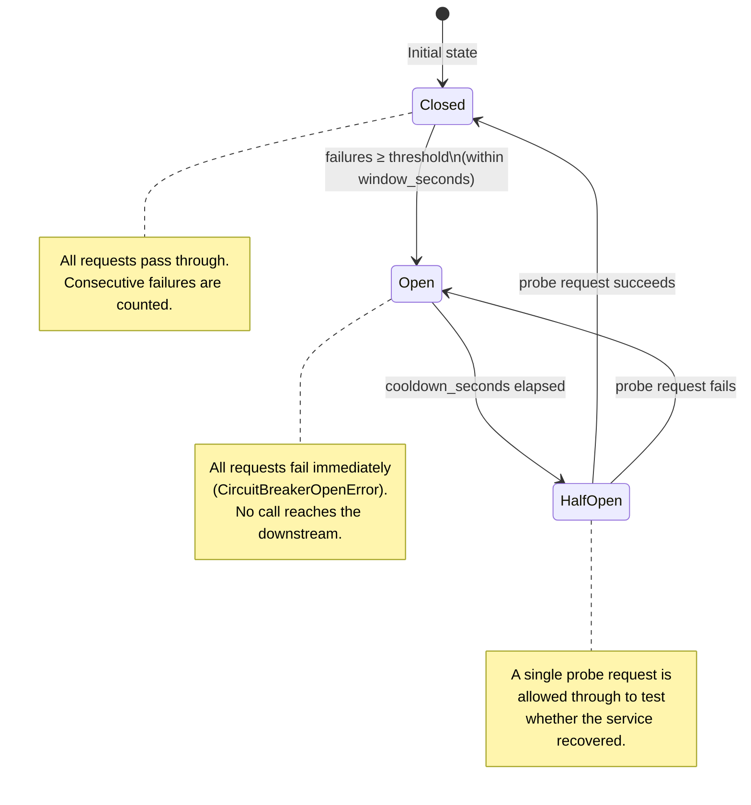
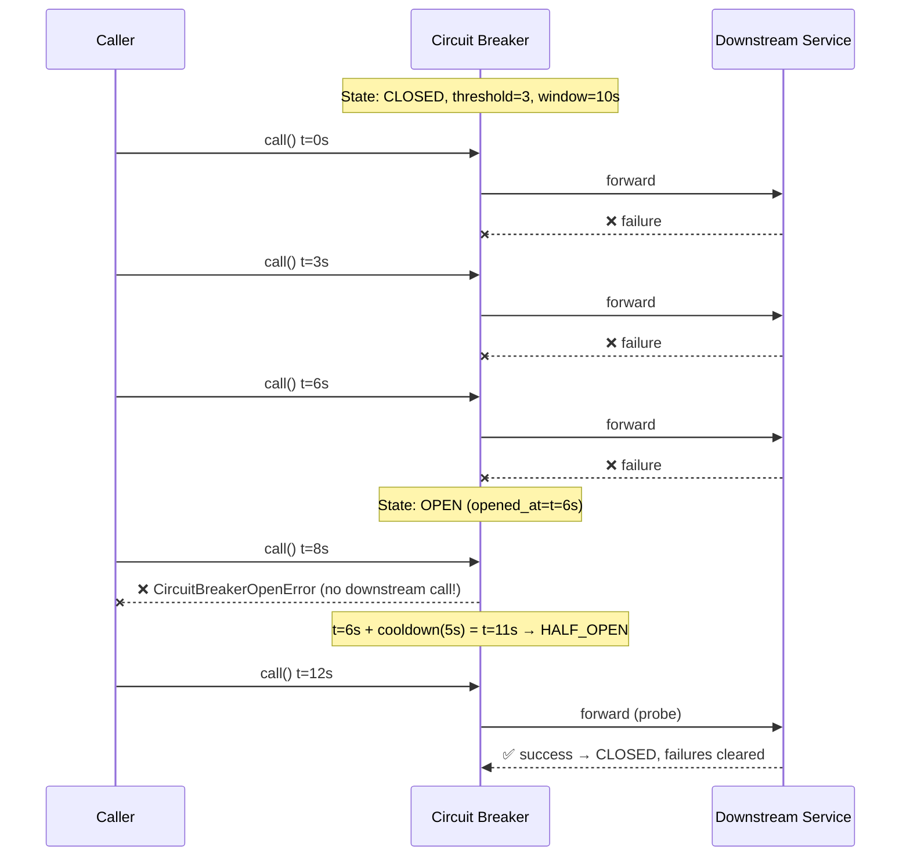
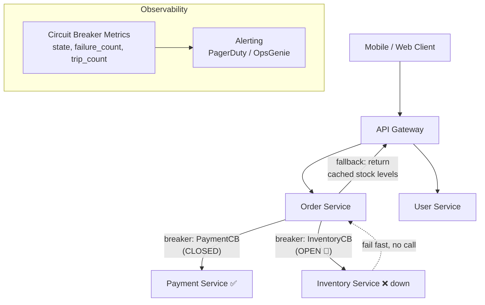

# Project 6 — Circuit Breaker

## Why This Pattern Exists

In a distributed system every network call can fail. When a downstream service
starts failing (due to deployment, overload, or network issues), callers that
keep retrying pile up waiting threads, exhaust connection pools, and eventually
take the calling service down too. This is called a **cascading failure**.

The Circuit Breaker pattern, first described by Michael Nygard in
*Release It!* (2007) and popularised by Netflix's **Hystrix** library, solves
this by wrapping remote calls in a finite state machine that **fails fast** when
the downstream is unhealthy.

---

## State Machine



---

## Concepts Demonstrated

| Concept | Description |
|---|---|
| **Finite state machine** | Three states with well-defined transitions |
| **Fail-fast** | Reject calls immediately when OPEN — no wasted threads |
| **Automatic recovery** | HALF_OPEN probe lets the system self-heal |
| **Sliding window** | Optional time window so old failures don't count forever |
| **Thread safety** | All state mutations protected by a `threading.Lock` |
| **Decorator interface** | Use as `@breaker` to wrap any function |

---

## Real-World Usage

| Company | Technology | Notes |
|---|---|---|
| **Netflix** | Hystrix (Java), now Resilience4j | Wraps every inter-service RPC; built-in bulkhead and fallback |
| **Amazon** | Custom per-team implementations | Every AWS service uses circuit breakers for dependency isolation |
| **Uber** | Custom Go/Java circuit breakers | Per-endpoint breakers across 2,000+ microservices |
| **Spring Cloud** | Resilience4j / Spring Circuit Breaker | De-facto Java ecosystem standard |

---

## Quick Start

```python
from circuit_breaker import CircuitBreaker, CircuitBreakerOpenError
import requests

# Create a breaker: trip after 3 failures in 10 s, stay open 5 s
breaker = CircuitBreaker(
    failure_threshold=3,
    cooldown_seconds=5.0,
    window_seconds=10.0,
    name="PaymentService",
)

def call_payment_service(order_id: int) -> dict:
    return requests.post("https://payments.example.com/charge", json={"order": order_id}).json()

# Use via .call()
try:
    result = breaker.call(call_payment_service, order_id=42)
except CircuitBreakerOpenError as e:
    # Fail fast — return a cached result or degrade gracefully
    print(f"Circuit open: {e}")
except Exception as e:
    # Downstream error (recorded as failure)
    print(f"Payment failed: {e}")

# Or use as a decorator
@breaker
def charge(order_id: int) -> dict:
    return requests.post("https://payments.example.com/charge", json={"order": order_id}).json()
```

---

## How the Sliding Window Works



---

## Architecture: Circuit Breaker in a Microservices Stack



When `InventoryCB` is OPEN, the Order Service **immediately** returns a fallback
response (cached stock data) instead of waiting 30 seconds for a timeout.
This protects the Order Service's thread pool from exhaustion.

---

## Running the Tests

```bash
cd 06-circuit-breaker
pip install -r requirements.txt
pytest tests/ -v
```
