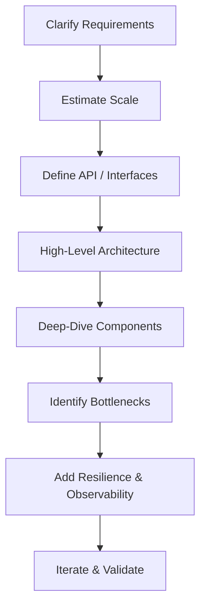
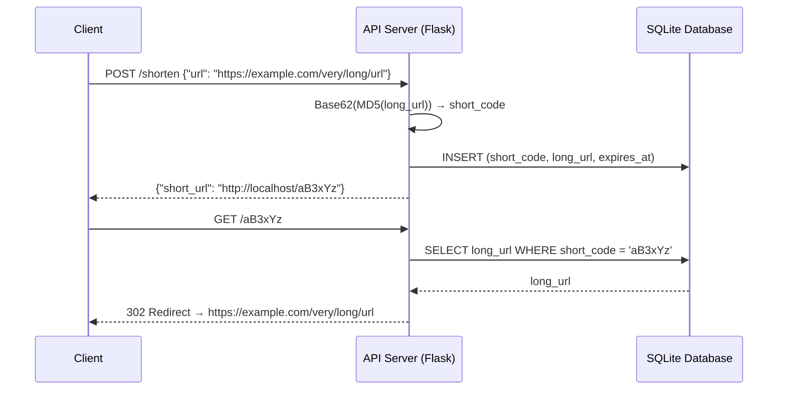
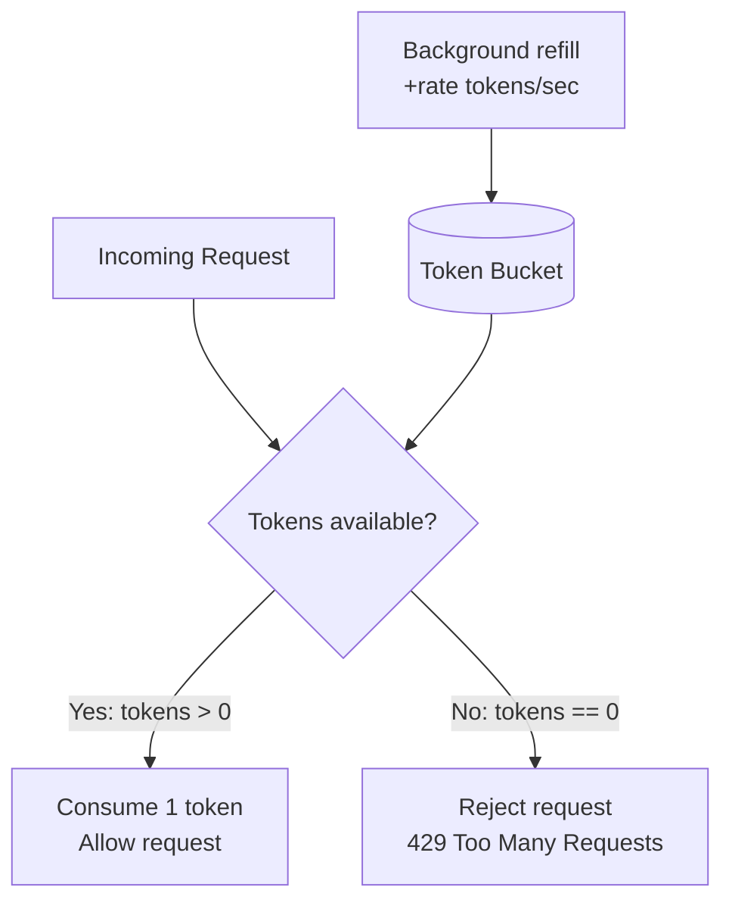
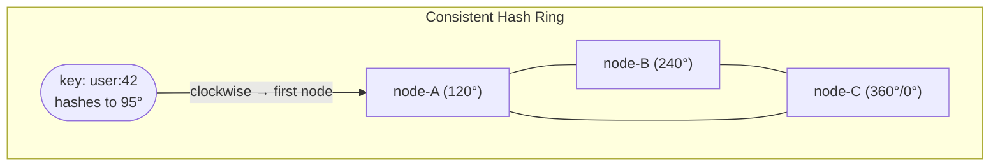
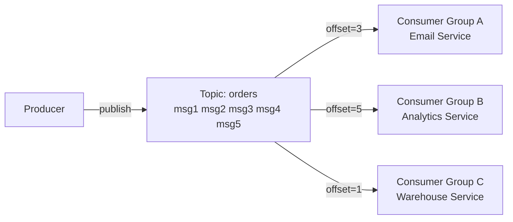
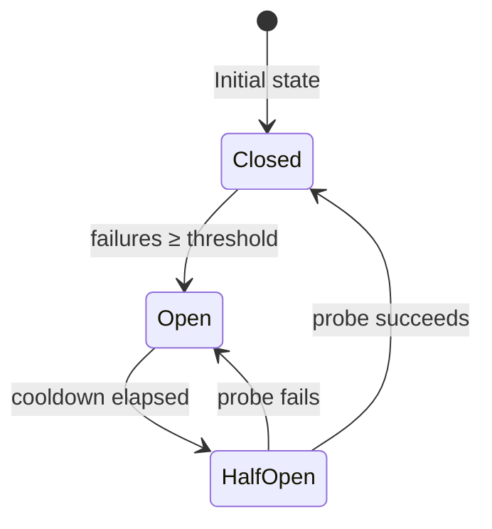

# System Design Architecture — Tutorial with Projects

A hands-on tutorial covering the most important **System Design** concepts, each paired with a working Python implementation you can run, study, and extend.

> 📖 **New:** See [SYSTEM_DESIGN.md](./SYSTEM_DESIGN.md) for a comprehensive deep-dive into system design theory, principles, and real-world case studies (Netflix, Amazon, Twitter/X, Uber, WhatsApp) with Mermaid diagrams.

---

## Table of Contents

1. [What is System Design?](#what-is-system-design)
2. [Core Concepts](#core-concepts)
3. [Projects](#projects)
4. [How to Run](#how-to-run)
5. [Architecture Diagrams](#architecture-diagrams)

---

## What is System Design?

System Design is the process of defining the **architecture, components, modules, interfaces, and data flows** of a system to satisfy specified requirements. It bridges business requirements and engineering implementation.

Key goals:
- **Scalability** — handle growing load gracefully
- **Availability** — stay up even when parts fail
- **Reliability** — produce correct results consistently
- **Performance** — respond quickly under load
- **Maintainability** — easy to change and operate



---

## Core Concepts

| Concept | Description |
|---|---|
| **Horizontal Scaling** | Add more machines to distribute load |
| **Vertical Scaling** | Upgrade existing machines (CPU/RAM) |
| **Load Balancing** | Distribute requests evenly across servers |
| **Caching** | Store frequently-accessed data close to consumers |
| **Consistent Hashing** | Minimise key remapping when nodes join/leave |
| **Rate Limiting** | Protect services from abuse and overload |
| **Message Queues** | Decouple producers and consumers asynchronously |
| **CAP Theorem** | A distributed system can guarantee at most 2 of: Consistency, Availability, Partition Tolerance |
| **Database Sharding** | Split a large database across multiple machines |
| **Replication** | Maintain copies of data on multiple nodes |
| **Circuit Breaker** | Prevent cascading failures when a downstream service is unhealthy |

---

## Projects

### [Project 1 — URL Shortener](./01-url-shortener/)

**Concepts demonstrated:** hashing, storage, redirect logic, Base62 encoding, collision handling.

A fully functional URL shortening service (similar to bit.ly) built with Flask and SQLite. Supports:
- Creating short codes for long URLs
- Redirecting short codes to original URLs
- Click-count tracking
- Expiry support

### [Project 2 — Rate Limiter](./02-rate-limiter/)

**Concepts demonstrated:** Token Bucket algorithm, Sliding Window algorithm, thread safety.

Two production-grade rate-limiting algorithms implemented in Python:
- **Token Bucket** — allows bursts up to a configured capacity
- **Sliding Window Counter** — smooth per-second request limiting

### [Project 3 — LRU Cache](./03-lru-cache/)

**Concepts demonstrated:** doubly-linked list, hash map, O(1) get/put, eviction policy.

An O(1) Least-Recently-Used cache backed by a doubly-linked list and a dictionary — the same structure used in operating systems, browsers, and CDNs.

### [Project 4 — Consistent Hashing](./04-consistent-hashing/)

**Concepts demonstrated:** hash ring, virtual nodes, node addition/removal, minimal key remapping.

A hash ring with virtual node support. Adding or removing a server only remaps a small fraction of keys — critical for distributed caches and databases.

### [Project 5 — Pub/Sub Message Queue](./05-message-queue/)

**Concepts demonstrated:** publish/subscribe pattern, topics, consumer groups, offset tracking, async decoupling.

An in-memory message broker inspired by Apache Kafka. Supports multiple topics, multiple consumer groups with independent offsets, and message retention.

### [Project 6 — Circuit Breaker](./06-circuit-breaker/)

**Concepts demonstrated:** finite state machine, fail-fast, cascading failure prevention, automatic recovery, thread safety.

A production-grade Circuit Breaker implementation inspired by Netflix Hystrix. The breaker moves through three states (CLOSED → OPEN → HALF_OPEN) to protect services from being taken down by failing dependencies.

---

## How to Run

### Prerequisites

```
Python 3.8+
pip
```

### Install dependencies

Each project has its own `requirements.txt`. For example:

```bash
cd 01-url-shortener
pip install -r requirements.txt
python app.py
```

### Run tests

Each project includes a `tests/` directory with `pytest` tests:

```bash
# Run all tests across all projects
pip install pytest
pytest

# Run tests for one project
pytest 01-url-shortener/tests/
pytest 06-circuit-breaker/tests/
```

---

## Architecture Diagrams

### URL Shortener



### Rate Limiter (Token Bucket)



### LRU Cache

```mermaid
graph LR
    subgraph Cache["LRU Cache (capacity=3)"]
        direction LR
        Head[HEAD sentinel] <--> A[key=C\nMRU] <--> B[key=B] <--> C[key=A\nLRU] <--> Tail[TAIL sentinel]
    end
    HashMap["HashMap\n{A→nodeA, B→nodeB, C→nodeC}"] -.->|O(1) lookup| A & B & C
```

### Consistent Hash Ring



### Pub/Sub Message Queue



### Circuit Breaker


