# System Design — Complete Reference Guide

A comprehensive, deep-dive reference covering everything you need to know about
System Design: **what** it is, **why** it matters, and **how** to apply it —
illustrated with Mermaid diagrams and real-world company case studies.

---

## Table of Contents

1. [What is System Design?](#1-what-is-system-design)
2. [Scalability](#2-scalability)
3. [Load Balancing](#3-load-balancing)
4. [Caching](#4-caching)
5. [Database Design](#5-database-design)
6. [CAP Theorem & PACELC](#6-cap-theorem--pacelc)
7. [ACID vs BASE](#7-acid-vs-base)
8. [Microservices vs Monolith](#8-microservices-vs-monolith)
9. [API Design](#9-api-design)
10. [Message Queues & Event-Driven Architecture](#10-message-queues--event-driven-architecture)
11. [Fault Tolerance & Resilience](#11-fault-tolerance--resilience)
12. [Observability](#12-observability)
13. [Real-World Case Studies](#13-real-world-case-studies)
    - [Netflix — Video Streaming at Scale](#131-netflix--video-streaming-at-scale)
    - [Amazon — E-Commerce & AWS](#132-amazon--e-commerce--aws)
    - [Twitter / X — Social Feed at Scale](#133-twitter--x--social-feed-at-scale)
    - [Uber — Real-Time Ride Matching](#134-uber--real-time-ride-matching)
    - [WhatsApp — Global Messaging](#135-whatsapp--global-messaging)

---

## 1. What is System Design?

### What

System Design is the process of **defining the architecture, components, modules,
interfaces, and data flows** of a system to satisfy a given set of functional and
non-functional requirements.

It answers three questions:

| Question | Meaning |
|---|---|
| **What** does the system need to do? | Functional requirements — features, APIs, user flows |
| **How** does it do it? | Technical choices — databases, queues, caches, protocols |
| **Why** those choices? | Trade-offs — consistency vs availability, latency vs throughput |

### Why

Poor system design leads to:
- Systems that collapse under load
- Outages that cost millions per minute (Amazon: ~$220k/min, Netflix: ~$456k/min)
- Impossible-to-change monoliths
- Data loss and security breaches

Good system design provides:
- **Scalability** — handle 10× or 1000× more users without rewrites
- **Availability** — 99.99% uptime ("four nines" = < 53 min downtime/year)
- **Reliability** — correct results every time
- **Maintainability** — add features without fear
- **Performance** — p99 latency < 100 ms at global scale

### How (The Design Process)

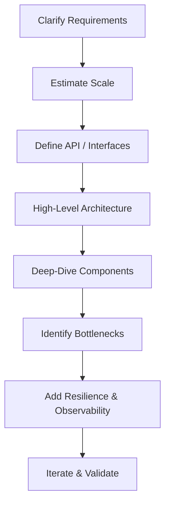

**Key steps:**
1. **Clarify requirements** — functional (features) and non-functional (SLAs, scale)
2. **Estimate scale** — QPS, storage, bandwidth (back-of-envelope calculations)
3. **Define API** — REST endpoints, gRPC methods, event schemas
4. **High-level architecture** — draw the major boxes and arrows first
5. **Deep-dive** — zoom into the hardest components
6. **Bottlenecks** — find the single point of failure and the hot path
7. **Resilience** — add retries, circuit breakers, rate limiters
8. **Observability** — metrics, logs, traces

---

## 2. Scalability

### What

Scalability is a system's ability to handle increased load by adding resources.

### Why

Traffic is never constant. A flash sale, a viral tweet, or a global event can
spike load 100× in seconds. A scalable system adapts without redesign.

### How

#### Vertical Scaling (Scale Up)

Add more CPU, RAM, or SSD to a single machine.

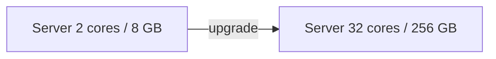

- **Pros:** Simple, no code changes
- **Cons:** Hard ceiling (biggest machine on the market), single point of failure, expensive

#### Horizontal Scaling (Scale Out)

Add more machines of the same type behind a load balancer.

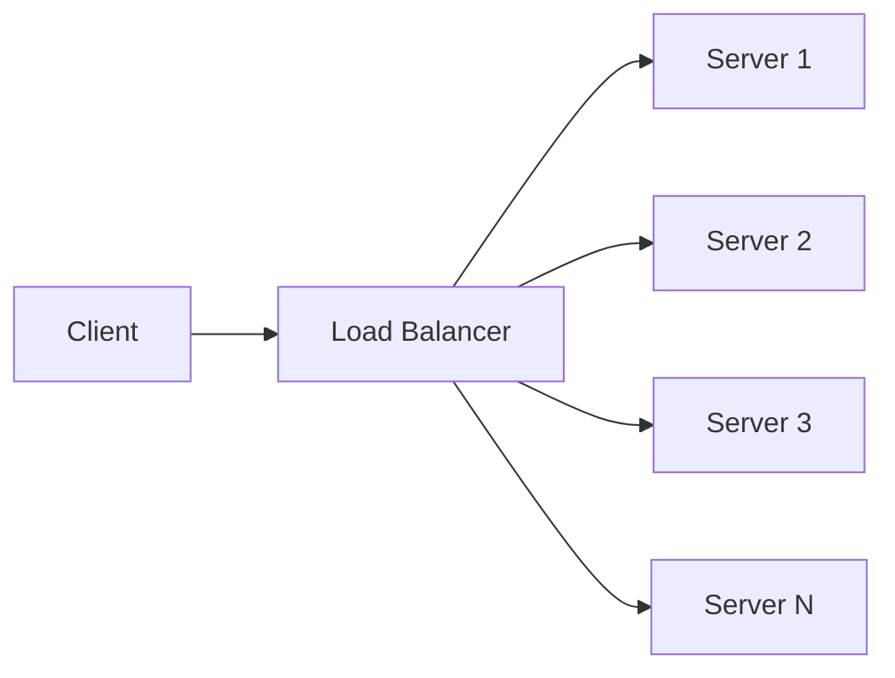

- **Pros:** Theoretically unlimited, fault-tolerant, cost-effective with commodity hardware
- **Cons:** Requires stateless services, distributed coordination, eventual consistency

#### Auto-Scaling

Cloud providers (AWS Auto Scaling, GCP Managed Instance Groups) automatically
add/remove servers based on CPU, memory, or custom metrics.

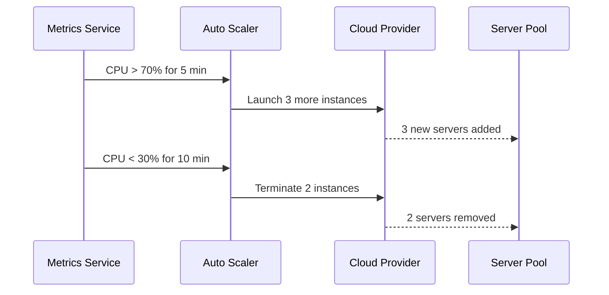

---

## 3. Load Balancing

### What

A load balancer distributes incoming requests across a pool of backend servers.

### Why

Without load balancing, one server handles everything — creating a performance
bottleneck and single point of failure.

### How

#### Algorithms

| Algorithm | How It Works | Best For |
|---|---|---|
| **Round Robin** | Requests go to servers in turn (1→2→3→1→2→3…) | Homogeneous servers, similar request costs |
| **Weighted Round Robin** | Servers with higher weight receive more requests | Heterogeneous server capacities |
| **Least Connections** | Requests go to the server with fewest active connections | Long-lived connections (WebSockets) |
| **IP Hash** | Client IP hashed to always map to the same server | Session stickiness without shared state |
| **Random** | Uniform random selection | Simple, low-overhead scenarios |
| **Resource-Based** | Route to least-loaded server (CPU, memory) | Complex, mixed workload environments |

#### L4 vs L7 Load Balancing

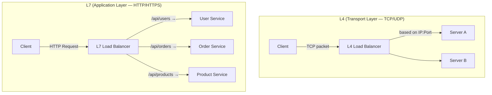

**L7 load balancers** (e.g., NGINX, AWS ALB) can route based on URL path, headers,
cookies — enabling microservices routing and A/B testing.

#### Health Checks

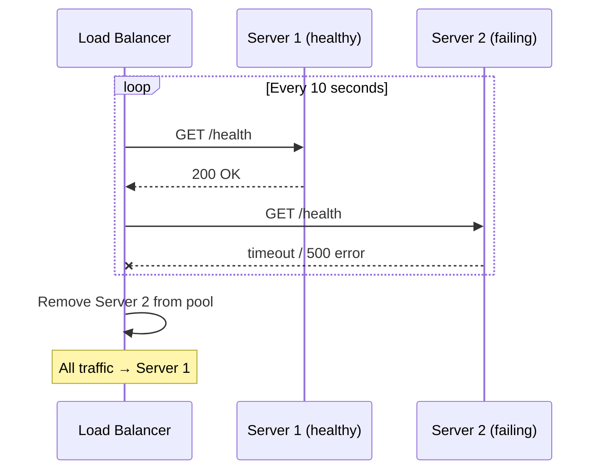

---

## 4. Caching

### What

Caching stores a copy of expensive-to-compute or frequently-accessed data
in a faster storage layer so future requests are served without re-computing.

### Why

Database queries often take 10–100 ms. A cache hit takes < 1 ms. For read-heavy
workloads (most consumer apps), caching reduces database load by 90%+ and
dramatically improves latency.

**Cache hit ratio** is the key metric: `hits / (hits + misses)`. Target > 90%.

### How

#### Cache Placement

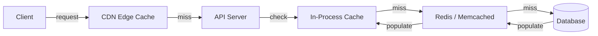

| Layer | Technology | Latency | Typical Use |
|---|---|---|---|
| Browser | localStorage / memory | < 0.1 ms | Static assets, auth tokens |
| CDN | Cloudflare, Akamai, CloudFront | 1–10 ms | Images, JS/CSS, HTML |
| Application | In-process dict/LRU | < 0.1 ms | Hot config, user sessions |
| Distributed | Redis, Memcached | 0.5–2 ms | Shared data across instances |
| Database | Query cache, buffer pool | 1–5 ms | Frequently run queries |

#### Cache Write Strategies

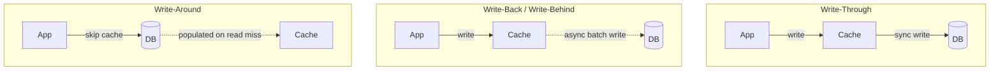

| Strategy | Consistency | Write Latency | Risk |
|---|---|---|---|
| Write-Through | Strong | Higher (sync write to DB) | None if cache fails |
| Write-Back | Eventual | Low (async) | Data loss if cache crashes |
| Write-Around | Strong | Low (no cache write) | Higher cache miss on first read |

#### Cache Eviction Policies

| Policy | Evicts | Best For |
|---|---|---|
| **LRU** (Least Recently Used) | The item not used for the longest time | General-purpose (most common) |
| **LFU** (Least Frequently Used) | The item accessed the fewest times | Long-lived popularity patterns |
| **FIFO** | The oldest inserted item | Simple time-based expiry |
| **TTL** (Time-To-Live) | Items older than a configured duration | Session data, tokens, rate limit windows |

#### Cache Invalidation Problems

The two hardest problems in computer science: naming things, cache invalidation,
and off-by-one errors.

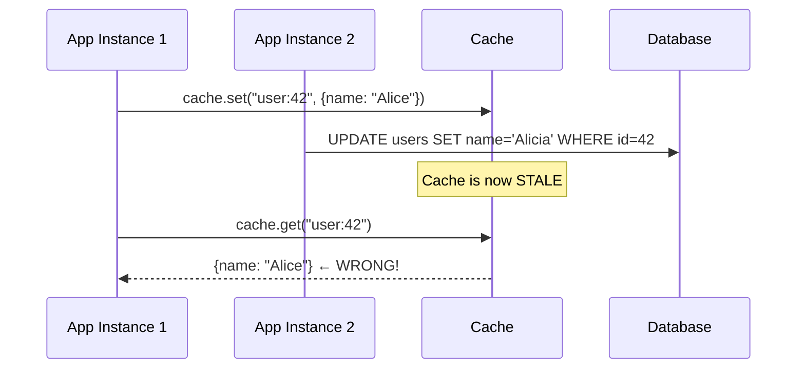

**Solutions:** TTL expiry, event-driven invalidation (write to DB → publish event → delete cache key), cache-aside with version tags.

---

## 5. Database Design

### What

Choosing the right database and data model is one of the most consequential
decisions in system design — it affects performance, scalability, and consistency
for the lifetime of the system.

### SQL vs NoSQL

| Dimension | SQL (Relational) | NoSQL |
|---|---|---|
| **Data model** | Tables with rows and foreign keys | Documents, key-value, graph, column |
| **Schema** | Fixed, enforced at write time | Flexible / schema-less |
| **Consistency** | ACID transactions | Typically eventual (BASE) |
| **Scaling** | Vertical primarily; horizontal is complex | Designed for horizontal scale |
| **Joins** | Native, efficient | Manual application-side joins |
| **Examples** | PostgreSQL, MySQL, SQLite | MongoDB, Cassandra, Redis, DynamoDB |

### Database Replication

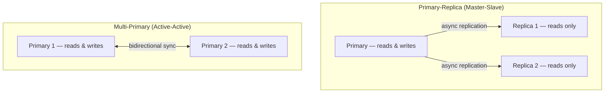

- **Primary-Replica:** Simple, strong consistency on writes; replicas can serve stale reads
- **Multi-Primary:** Higher write availability; harder to resolve conflicts

### Database Sharding

Splitting a large table across multiple machines (shards) so each machine holds
a subset of rows.

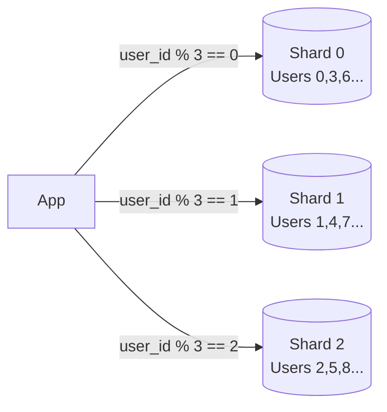

**Sharding strategies:**

| Strategy | How | Problem |
|---|---|---|
| **Hash sharding** | `hash(key) % N` | Re-hashing needed when N changes |
| **Range sharding** | IDs 0–999 → Shard A, 1000–1999 → Shard B | Hot spots if access is not uniform |
| **Directory sharding** | Lookup table maps key → shard | Lookup table is a bottleneck |
| **Consistent hashing** | Hash ring; minimal remapping on shard add/remove | Slightly uneven distribution without virtual nodes |

### Indexes

An index is a data structure (typically a B-Tree) that speeds up lookups at the
cost of slower writes and extra storage.

```mermaid
graph LR
    Query["SELECT * FROM orders\nWHERE user_id = 42"] -->|without index| FullScan[Full Table Scan\nO(N)]
    Query -->|with index on user_id| IndexLookup[B-Tree Lookup\nO(log N)]
    IndexLookup --> Rows[Return matching rows]
```

---

## 6. CAP Theorem & PACELC

### CAP Theorem

**What:** In a distributed system that is subject to network partitions, you can
guarantee at most two of three properties simultaneously:

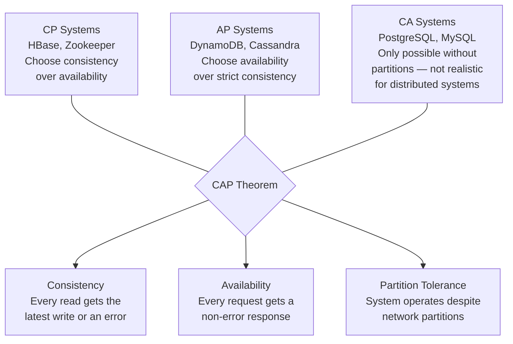

**Why it matters:** Network partitions *will* happen. You must choose between
consistency and availability during a partition. There is no magic answer.

### PACELC

An extension of CAP that addresses latency even when no partition occurs:

> "**P**artition → choose **A**vailability or **C**onsistency;
> **E**lse → choose **L**atency or **C**onsistency"

| System | Partition | Else | Example |
|---|---|---|---|
| DynamoDB | AP | EL | High availability, low latency, eventual consistency |
| HBase | CP | EC | Strong consistency even at higher latency cost |
| Cassandra | AP | EL | Tunable consistency (ONE to ALL) |
| Spanner (Google) | CP | EC | Globally consistent with TrueTime API |

---

## 7. ACID vs BASE

### ACID (Traditional Databases)

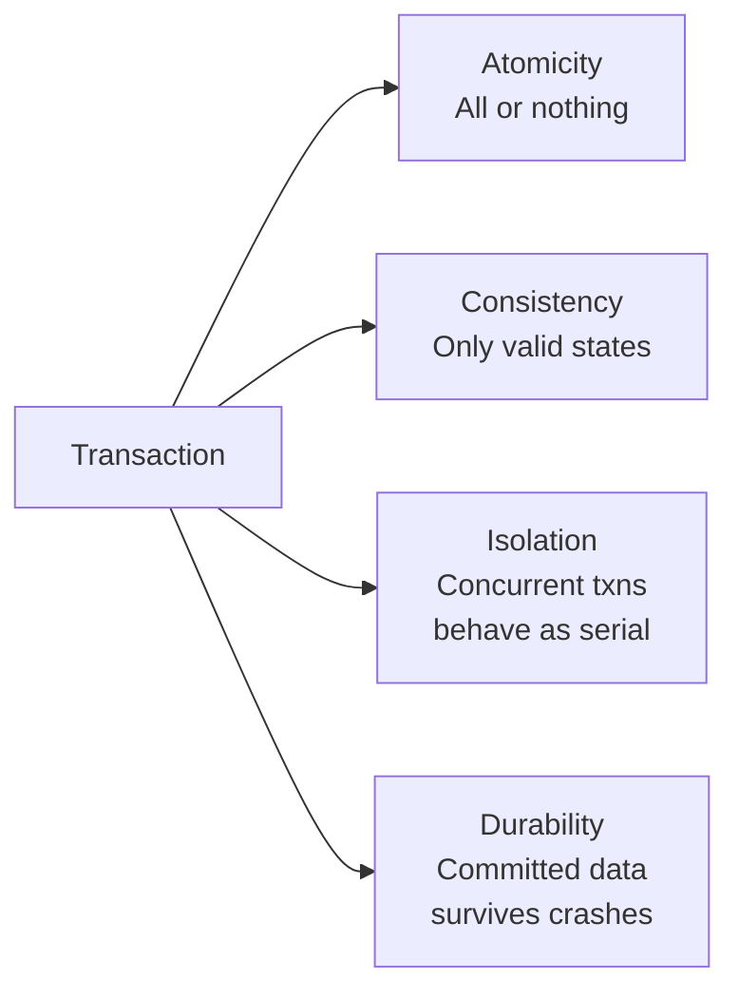

Used by: PostgreSQL, MySQL, SQLite, Oracle, SQL Server

### BASE (NoSQL / Distributed)

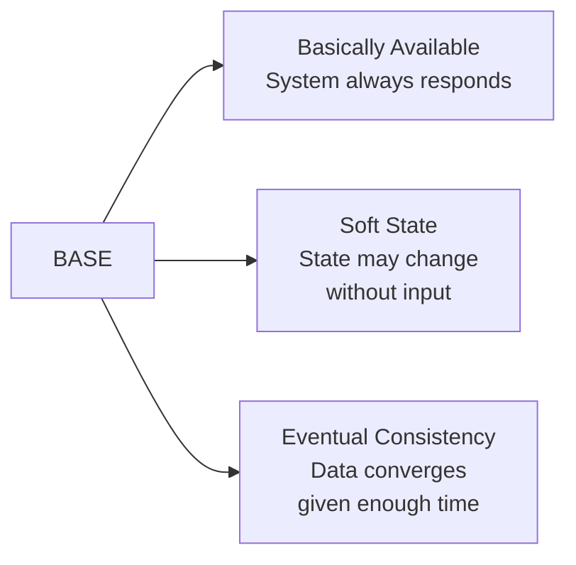

Used by: DynamoDB, Cassandra, CouchDB, Riak

### When to Use Each

| Use ACID when… | Use BASE when… |
|---|---|
| Financial transactions (banking, payments) | User activity feeds, notifications |
| Inventory management (double-booking risks) | Shopping cart recommendations |
| Medical records | Social media likes/views counters |
| Any domain where data loss = legal problem | Logging and analytics |

---

## 8. Microservices vs Monolith

### Monolith

A single deployable unit where all features share the same codebase, runtime, and database.

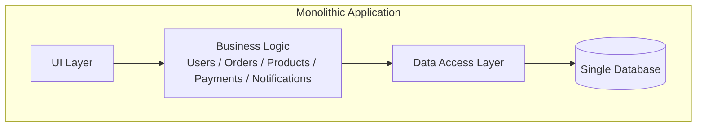

**Pros:** Simple to develop initially, easy to test, no network hops between components
**Cons:** Long build/deploy cycles, scaling the whole app to fix one bottleneck, tight coupling

### Microservices

Each feature is an independent service with its own database, deployed separately.

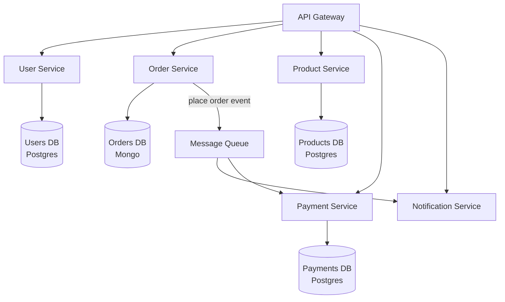

**Pros:** Independent scaling, independent deployment, technology flexibility, fault isolation
**Cons:** Network latency between services, distributed tracing complexity, eventual consistency challenges

### When to Choose

| Choose Monolith when… | Choose Microservices when… |
|---|---|
| Small team (< 5 engineers) | Large team (10+ engineers, multiple squads) |
| Early-stage startup (requirements unclear) | Clear domain boundaries |
| Low traffic / simple scaling needs | Different scaling needs per feature |
| Fast initial development is the priority | Independent release cadences needed |

---

## 9. API Design

### REST

Representational State Transfer — HTTP verbs mapped to CRUD operations on resources.

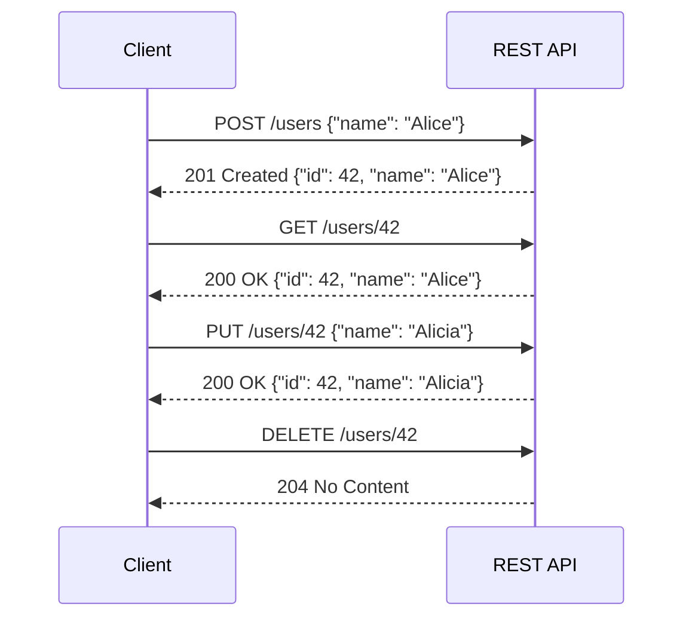

### GraphQL

A query language where the client specifies exactly what fields it needs — no
over-fetching or under-fetching.

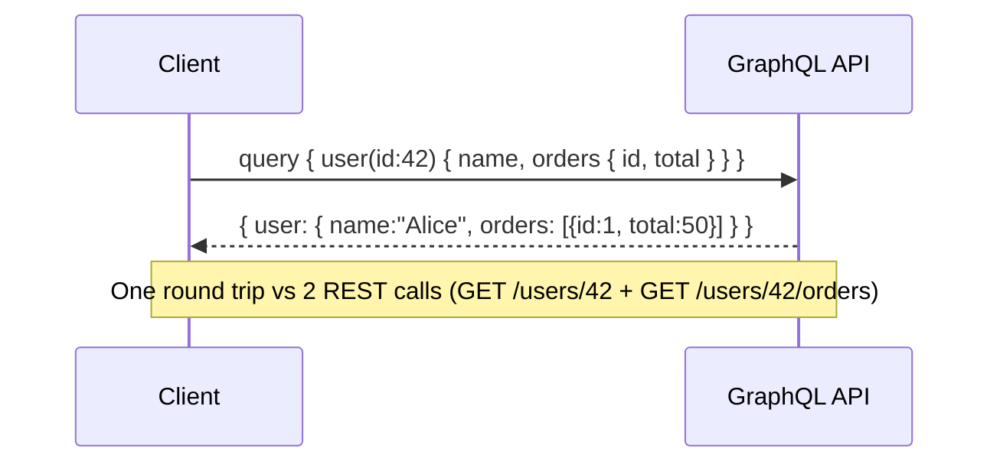

### gRPC

Google's high-performance RPC framework using Protocol Buffers — ideal for
internal service-to-service communication.

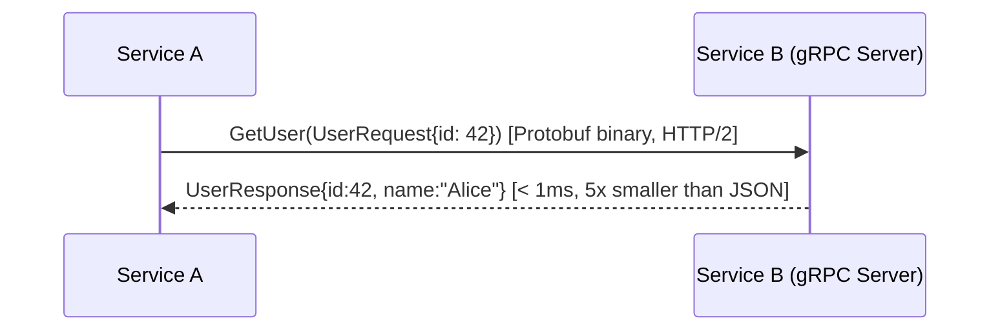

| Dimension | REST | GraphQL | gRPC |
|---|---|---|---|
| Protocol | HTTP/1.1 | HTTP/1.1 | HTTP/2 |
| Payload | JSON | JSON | Protobuf (binary) |
| Performance | Medium | Medium | High |
| Browser-friendly | ✅ | ✅ | ⚠️ (needs proxy) |
| Best for | Public APIs, simple CRUD | Client-driven queries, BFF | Internal microservices |

---

## 10. Message Queues & Event-Driven Architecture

### What

A message queue is a durable buffer between producers (services that emit events)
and consumers (services that process them), enabling **asynchronous, decoupled** communication.

### Why

Without a queue, Service A must wait for Service B to respond:

```mermaid
sequenceDiagram
    participant A as Order Service
    participant B as Email Service
    participant C as Inventory Service
    participant D as Analytics Service

    Note over A: Synchronous (fragile)
    A->>B: send_confirmation_email() ← must wait
    B-->>A: ok (200ms)
    A->>C: decrement_stock() ← must wait
    C-->>A: ok (50ms)
    A->>D: record_sale() ← must wait
    D-->>A: ok (100ms)
    Note over A: Total: 350ms + tight coupling
```

With a message queue:

```mermaid
sequenceDiagram
    participant A as Order Service
    participant Q as Message Queue
    participant B as Email Service
    participant C as Inventory Service
    participant D as Analytics Service

    Note over A: Asynchronous (resilient)
    A->>Q: publish("order.placed", {order_id: 99})
    Q-->>A: ack (1ms)
    Note over A: Return to client immediately!
    Q->>B: consume "order.placed"
    Q->>C: consume "order.placed"
    Q->>D: consume "order.placed"
    Note over B,D: Process independently, at own pace
```

### Key Concepts

| Concept | Description |
|---|---|
| **Topic / Queue** | Named channel where messages are published |
| **Producer** | Service that publishes messages |
| **Consumer** | Service that reads and processes messages |
| **Consumer Group** | Group of consumers sharing a topic; each message processed once per group |
| **Offset** | Position in the message log; allows replay |
| **Dead Letter Queue** | Holds messages that failed to process after N retries |
| **Backpressure** | Mechanism to slow producers when consumers can't keep up |

### Popular Systems

| System | Model | Retention | Best For |
|---|---|---|---|
| Apache Kafka | Append-only log | Configurable (days/weeks) | Event sourcing, audit logs, streaming |
| RabbitMQ | Push-based queue | Until consumed | Task queues, RPC patterns |
| AWS SQS | Pull-based queue | Up to 14 days | Cloud-native, simple decoupling |
| Redis Streams | Append-only log | Configurable | Lightweight Kafka alternative |

---

## 11. Fault Tolerance & Resilience

### What

A fault-tolerant system continues operating correctly even when components fail.
Failures in distributed systems are not exceptional — they are the norm.

### Failure Modes

```mermaid
graph TD
    Failures[Common Failure Modes]
    Failures --> Crash[Service crash\n- Restart policy\n- Health checks]
    Failures --> Slow[Slow response\n- Timeouts\n- Circuit breakers]
    Failures --> Net[Network partition\n- Retries with backoff\n- Fallbacks]
    Failures --> OOM[Out of memory\n- Rate limiting\n- Backpressure]
    Failures --> Corrupt[Data corruption\n- Checksums\n- Replication]
```

### Circuit Breaker Pattern

Named after electrical circuit breakers, this pattern prevents cascading failures
when a downstream service is unavailable.

```mermaid
stateDiagram-v2
    [*] --> Closed : Initial state\n(normal operation)
    Closed --> Open : failure_count ≥ threshold\nin time window
    Open --> HalfOpen : after cooldown_seconds
    HalfOpen --> Closed : probe request succeeds
    HalfOpen --> Open : probe request fails

    note right of Closed : All requests pass through\nFailures counted
    note right of Open : All requests fail fast\n(no call to downstream)
    note right of HalfOpen : Single probe request allowed\nto test recovery
```

**Why it matters:** Without a circuit breaker, a slow/failing downstream service
causes threads to pile up waiting — eventually exhausting the thread pool and
taking down the calling service too (cascading failure).

### Retry with Exponential Backoff

```mermaid
sequenceDiagram
    participant C as Client
    participant S as Service

    C->>S: Request (attempt 1)
    S--x C: 503 Service Unavailable
    Note over C: Wait 1s
    C->>S: Request (attempt 2)
    S--x C: 503 Service Unavailable
    Note over C: Wait 2s (exponential)
    C->>S: Request (attempt 3)
    S--x C: 503 Service Unavailable
    Note over C: Wait 4s + jitter (prevent thundering herd)
    C->>S: Request (attempt 4)
    S-->>C: 200 OK
```

### Bulkhead Pattern

Isolate resources so that failures in one part don't exhaust shared resources.

```mermaid
graph LR
    subgraph NoBulkhead["Without Bulkheads"]
        SharedPool[Shared Thread Pool\n20 threads]
        SharedPool --> API[API calls]
        SharedPool --> DB[DB queries]
        SharedPool --> Ext[External service\n- SLOW -]
        Note1[Ext service saturates all 20 threads\n→ API and DB also fail]
    end

    subgraph WithBulkhead["With Bulkheads"]
        P1[API Pool\n10 threads]
        P2[DB Pool\n5 threads]
        P3[Ext Pool\n5 threads]
        Note2[Ext service fails its 5 threads only\n→ API and DB unaffected]
    end
```

---

## 12. Observability

### What

Observability is the ability to understand what a system is doing internally from
its external outputs. It rests on three pillars:

```mermaid
graph LR
    O[Observability] --> L[Logs\nStructured text records\nof discrete events]
    O --> M[Metrics\nNumeric time-series\ne.g. req/sec, p99 latency]
    O --> T[Traces\nEnd-to-end path of\na request through services]
```

### Distributed Tracing

```mermaid
sequenceDiagram
    participant C as Client
    participant GW as Gateway [trace_id=abc, span=1]
    participant US as User Service [span=2]
    participant DB as Database [span=3]

    C->>GW: GET /profile
    GW->>US: GetUser(id=42) [propagate trace_id=abc]
    US->>DB: SELECT * FROM users WHERE id=42
    DB-->>US: row data [span=3 ends: 2ms]
    US-->>GW: user object [span=2 ends: 5ms]
    GW-->>C: 200 OK [span=1 ends: 8ms]
    Note over C,DB: Full trace: 8ms total, breakdown visible in Jaeger/Zipkin
```

### Key Metrics to Track

| Category | Metrics |
|---|---|
| **Latency** | p50, p95, p99, p999 response times |
| **Throughput** | Requests per second (RPS), events per second |
| **Error rate** | 4xx and 5xx rates |
| **Saturation** | CPU %, memory %, queue depth, thread pool usage |
| **Availability** | Uptime %, success rate, SLO compliance |

The **USE method** (Utilization, Saturation, Errors) and **RED method**
(Rate, Errors, Duration) are popular frameworks for service health dashboards.

---

## 13. Real-World Case Studies

---

### 13.1 Netflix — Video Streaming at Scale

Netflix serves **250 million+ subscribers** across 190 countries, streaming
**~15% of global internet traffic** at peak hours.

#### High-Level Architecture

```mermaid
graph TD
    User[User Device\niOS / Android / TV / Web]
    User -->|HTTPS| CDN[Netflix OpenConnect CDN\n~17,000 servers in ISP networks]
    CDN -->|cache miss| Origin[Origin Servers\nAWS us-east-1]

    User -->|API calls| Gateway[Zuul API Gateway\nAuth, routing, rate limiting]
    Gateway --> US[User Service]
    Gateway --> RS[Recommendation Service\nSpark ML models]
    Gateway --> SS[Search Service\nElasticSearch]
    Gateway --> PS[Playback Service\nlicensing, DRM, manifest]

    US --> Cassandra[(Cassandra\nUser profiles, watch history)]
    RS --> EVCache[(EVCache\nMemcached-based CDN-edge cache)]
    PS --> MySQL[(MySQL\nBilling, memberships)]

    subgraph DataPipeline["Data Pipeline"]
        Kafka[Apache Kafka\n>500 billion events/day]
        Flink[Apache Flink\nReal-time stream processing]
        S3[AWS S3\nData lake]
        Kafka --> Flink
        Kafka --> S3
    end
```

#### Video Encoding Pipeline

```mermaid
flowchart LR
    Raw[Raw Video\nfrom studio] -->|upload| S3[AWS S3]
    S3 --> Conductor[Netflix Conductor\nOrchestration engine]
    Conductor --> E1[Encoding Worker\n4K HDR H.265]
    Conductor --> E2[Encoding Worker\n1080p H.264]
    Conductor --> E3[Encoding Worker\n720p H.264]
    Conductor --> E4[Encoding Worker\n360p H.264]
    Conductor --> E5[Audio Worker\nMulti-language tracks]
    Conductor --> E6[Subtitle Worker\n30+ languages]
    E1 & E2 & E3 & E4 --> Manifest[MPEG-DASH / HLS Manifest\nadaptive bitrate chunks]
    Manifest --> CDN[OpenConnect CDN]
```

Netflix encodes each title into **~1,200 different files** (combinations of
resolution, codec, bitrate, audio track, subtitle).

#### Chaos Engineering (Chaos Monkey)

Netflix invented **Chaos Engineering** — deliberately killing random services
in production to verify that systems are resilient to failures.

```mermaid
graph LR
    CM[Chaos Monkey] -->|randomly kills| S1[Service Instance A]
    CM -->|randomly kills| S2[Service Instance B]
    Monitor[Monitor] -->|observes| System[Netflix System]
    System -->|degrades gracefully?| Check{SLO Met?}
    Check -->|Yes| OK[Confidence in resilience]
    Check -->|No| Fix[Fix weak point, retry]
```

**Key technologies:** AWS (primary cloud), Cassandra (NoSQL profiles), Kafka (event streaming),
Zuul (API gateway), Hystrix (circuit breaker), EVCache (distributed cache), Spinnaker (deployment).

---

### 13.2 Amazon — E-Commerce & AWS

Amazon processes **~66,000 orders per hour** on normal days and many more on Prime Day.
AWS serves **31% of global cloud infrastructure**.

#### E-Commerce Order Flow

```mermaid
sequenceDiagram
    participant U as User
    participant GW as API Gateway
    participant Cart as Cart Service
    participant Order as Order Service
    participant Inv as Inventory Service
    participant Pay as Payment Service
    participant Notify as Notification Service
    participant Kafka as Event Bus (Kafka)

    U->>GW: POST /checkout
    GW->>Cart: GetCart(user_id)
    Cart-->>GW: CartItems[]
    GW->>Inv: ReserveItems(CartItems)
    Inv-->>GW: reservation_id (optimistic lock)
    GW->>Pay: Charge(user_id, amount)
    Pay-->>GW: payment_id
    GW->>Order: CreateOrder(cart, reservation, payment)
    Order-->>GW: order_id
    GW-->>U: 201 Created {order_id}

    Order->>Kafka: publish("order.created", order_id)
    Kafka->>Inv: confirm reservation (deduct stock)
    Kafka->>Notify: send confirmation email/SMS
    Kafka->>Warehouse: dispatch fulfillment
```

#### DynamoDB Architecture

Amazon's DynamoDB — the NoSQL database powering much of Amazon and AWS — is
built on consistent hashing and Paxos-based replication:

```mermaid
graph TD
    Client[DynamoDB Client]
    Client -->|hash(partition_key)| Router[Request Router\nconsistent hash ring]
    Router --> N1[Storage Node 1\nLeader + 2 replicas]
    Router --> N2[Storage Node 2\nLeader + 2 replicas]
    Router --> N3[Storage Node 3\nLeader + 2 replicas]

    N1 --> R1a[Replica 1a]
    N1 --> R1b[Replica 1b]
    N2 --> R2a[Replica 2a]
    N2 --> R2b[Replica 2b]

    subgraph ConsistencyModes["Consistency Options"]
        EC[Eventually Consistent Read\nAny replica — lower latency]
        SC[Strongly Consistent Read\nLeader only — higher latency]
    end
```

**Key Amazon technologies:** DynamoDB (NoSQL), Aurora (relational), SQS/SNS (messaging),
Lambda (serverless), ElastiCache (Redis/Memcached), CloudFront (CDN).

---

### 13.3 Twitter / X — Social Feed at Scale

Twitter (now X) serves **~500 million tweets per day** to **~350 million active users**.
The core challenge: **tweet fanout** — when a user with 100 million followers tweets,
how do you deliver it to everyone's timeline within seconds?

#### Tweet Fanout Strategies

```mermaid
flowchart TD
    T[User tweets] --> TS[Tweet Service\nStore tweet in DB]
    TS --> FanoutDecision{Fanout strategy?}

    FanoutDecision -->|Regular user < 10k followers| PushFanout[Push Fanout\nWrite tweet_id to each\nfollower's Timeline Cache]
    FanoutDecision -->|Celebrity > 1M followers| PullFanout[Pull Fanout\nDon't pre-populate\nMerge on read]

    PushFanout --> RedisTimeline[Redis Timeline Cache\nList of tweet_ids per user]
    PullFanout --> CelebDB[Celebrity Tweet DB\nLookup on timeline load]

    RedisTimeline --> TimelineService[Timeline Service\nFetch tweet details]
    CelebDB --> TimelineService
    TimelineService --> Client[User's Timeline]
```

#### High-Level System Architecture

```mermaid
graph TD
    Client[Twitter Client]
    Client --> LB[Load Balancer]
    LB --> API[API Servers\nRuby / Scala]
    API --> TweetService[Tweet Service\nScala / Finagle]
    API --> TimelineService[Timeline Service]
    API --> SearchService[Search Service\nEarlybird / Lucene]
    API --> UserService[User Service]

    TweetService --> MySQL[(MySQL\nTweet storage\nwith Gizzard sharding)]
    TweetService --> Kafka[Kafka\nFanout pipeline]
    Kafka --> FanoutWorker[Fanout Workers\n→ push to follower timelines]
    FanoutWorker --> Redis[(Redis Cluster\nTimeline cache\n~800 tweet_ids per user)]

    TimelineService --> Redis
    TimelineService --> TweetService

    UserService --> Manhattan[(Manhattan\nTwitter's custom\ndistributed key-value store)]
```

**Key challenge:** The "Lady Gaga problem" — a single tweet from a user with 80M+ followers
generates 80M+ write operations. Twitter solves this with a hybrid push/pull approach.

**Key technologies:** Kafka (fanout), Redis (timeline cache), MySQL+Gizzard (tweet storage),
Manhattan (key-value store), Finagle (RPC framework), Lucene/Earlybird (real-time search).

---

### 13.4 Uber — Real-Time Ride Matching

Uber processes **~19 million trips per day** across 70+ countries, requiring
sub-second matching between riders and drivers on a constantly-changing map.

#### Ride Request Flow

```mermaid
sequenceDiagram
    participant R as Rider App
    participant GW as API Gateway
    participant DS as Dispatch Service
    participant LS as Location Service
    participant PS as Pricing Service
    participant D as Driver App
    participant Notify as Notification Service

    R->>GW: POST /request-ride {pickup, dropoff}
    GW->>PS: EstimateFare(pickup, dropoff)
    PS-->>GW: {fare_estimate, surge_multiplier}
    GW-->>R: Show price estimate

    R->>GW: Confirm ride
    GW->>LS: FindNearbyDrivers(pickup, radius=1km)
    LS-->>GW: [driver_1, driver_2, driver_3] sorted by ETA
    GW->>DS: AssignDriver(rider, driver_1)
    DS->>Notify: Push notification → Driver App
    D->>DS: Accept trip
    DS-->>R: Driver assigned {eta, driver_profile}
    Note over R,D: Live location updates every 4 seconds via WebSocket
```

#### Location Service Architecture

```mermaid
graph TD
    DriverApp[Driver App] -->|GPS update every 4s| IngestionAPI[Location Ingestion API]
    IngestionAPI --> Kafka[Apache Kafka\nlocation events stream]
    Kafka --> LocationWorker[Location Update Worker]
    LocationWorker --> GeoIndex[Geospatial Index\nS2 geometry library\nhierarchical grid cells]

    RiderRequest[Rider requests ride] --> DispatchService[Dispatch Service]
    DispatchService --> GeoIndex
    GeoIndex -->|nearby drivers| DispatchService
    DispatchService --> MatchingEngine[ETA-based Matching\nOptimisation algorithm]

    subgraph SurgeDetection["Surge Pricing Engine"]
        GeoIndex -->|supply: driver count per cell| SurgeCalc[Surge Calculator]
        DemandStream[Demand Stream] --> SurgeCalc
        SurgeCalc --> SurgeMultiplier[Surge Multiplier\nreal-time heatmap]
    end
```

**Key technologies:** Kafka (location stream), Redis (driver location lookup), S2 geometry (geospatial indexing),
MySQL (trip records), Cassandra (user data), OSRM/Google Maps (routing/ETA).

---

### 13.5 WhatsApp — Global Messaging

WhatsApp sends **~100 billion messages per day** with only ~50 engineers
(at the time of its $19B Facebook acquisition in 2014). This is one of the best
examples of extreme efficiency in system design.

#### Message Delivery Architecture

```mermaid
sequenceDiagram
    participant A as Alice's Phone
    participant WS as WhatsApp Server\n(Erlang/OTP)
    participant Store as Message Store
    participant B as Bob's Phone

    A->>WS: Send message to Bob [encrypted E2E]
    WS->>Store: Store if Bob offline
    WS-->>A: Message delivered to server (✓)

    alt Bob is online
        WS->>B: Push message via persistent connection
        B-->>WS: ACK received
        WS-->>A: Message delivered to Bob (✓✓)
    else Bob is offline
        Store->>Store: Retain until Bob comes online
        B->>WS: Bob connects (reconnect)
        WS->>B: Deliver stored messages
        B-->>WS: ACK
        WS-->>A: Message delivered to Bob (✓✓)
    end
```

#### Why Erlang/OTP?

WhatsApp chose **Erlang** (the language for Ericsson telecom switches) because:
- Each connection is a lightweight Erlang process (not an OS thread)
- A single server runs **2–3 million concurrent connections**
- Built-in fault tolerance with supervisor trees ("let it crash" philosophy)
- Hot code reloading — deploy without dropping connections

```mermaid
graph TD
    subgraph ErlangNode["Erlang Node (single server)"]
        Supervisor[OTP Supervisor Tree]
        Supervisor --> P1[Process: Alice's connection\n~2 KB memory]
        Supervisor --> P2[Process: Bob's connection]
        Supervisor --> P3[Process: Carol's connection]
        Supervisor --> PM[Process: ... 2,999,997 more ...]
        Supervisor --> PX[Process: crashed!\nOTP auto-restarts it]
    end
```

#### End-to-End Encryption

WhatsApp uses the **Signal Protocol**:

```mermaid
sequenceDiagram
    participant A as Alice
    participant S as WhatsApp Server
    participant B as Bob

    Note over A,B: Key Exchange (one-time, async)
    A->>S: Upload Alice's public keys
    B->>S: Upload Bob's public keys
    A->>S: Fetch Bob's public key
    A->>A: Generate shared session key\nusing X3DH key agreement

    Note over A,B: Message Sending
    A->>A: Encrypt message with shared key (AES-256-GCM)
    A->>S: Encrypted ciphertext (server cannot decrypt)
    S->>B: Encrypted ciphertext
    B->>B: Decrypt with shared key
```

**Key technologies:** Erlang/OTP (message broker), Mnesia (Erlang distributed DB),
FreeBSD + SMP (OS), YAWS (web server), custom protocol over TLS (not HTTP).

---

## Summary: Key Principles to Remember

```mermaid
mindmap
  root((System Design))
    Scalability
      Horizontal scaling
      Vertical scaling
      Auto-scaling
      Stateless services
    Data
      SQL vs NoSQL
      Sharding
      Replication
      Indexes
      Caching layers
    Consistency
      CAP theorem
      ACID
      BASE
      Eventual consistency
    Communication
      REST APIs
      gRPC
      GraphQL
      Message queues
      Event-driven
    Resilience
      Circuit breakers
      Retries + backoff
      Bulkheads
      Chaos engineering
      Health checks
    Observability
      Metrics
      Logs
      Distributed traces
      Alerting
    Real-world
      Netflix CDN + microservices
      Amazon DynamoDB + event-driven
      Twitter fanout + Redis cache
      Uber geospatial + Kafka
      WhatsApp Erlang + E2EE
```

| Principle | Rule of Thumb |
|---|---|
| **Cache aggressively** | If it's read > 10× per write, cache it |
| **Async by default** | If the caller doesn't need the result immediately, use a queue |
| **Design for failure** | Every network call will eventually fail; plan for it |
| **Scale horizontally** | Prefer many small stateless services over one large stateful one |
| **Measure everything** | You cannot optimize what you do not measure |
| **Consistency is expensive** | Only pay the consistency cost where the business requires it |
| **Start simple** | Monolith first, extract services when you have proven bottlenecks |
